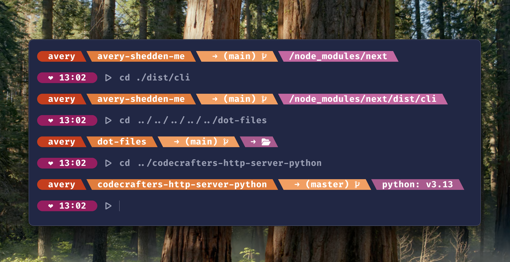

# Avery's Dot Files

# Avery's Dot Files

This repository contains my personal configuration files (dot files) for customizing my development environment.

## Table of Contents

- [Overview](#overview)
- [Features](#features)
- [Utility Scripts & Aliases](#utility-scripts--aliases)
- [Usage](#usage)
- [Customization](#customization)

## Overview

This configuration focuses on customizing the ZSH prompt directly, without relying on frameworks like Oh-My-ZSH or other external libraries. It's a lightweight approach that gives me exactly what I need without the overhead of larger solutions.

## Features

- Custom ZSH prompt styling
- Personal terminal configuration
- Development environment info

## Utility Scripts & Aliases

This setup includes a collection of custom utility scripts and aliases to streamline common development tasks and increase productivity. These shortcuts help automate repetitive commands and provide quick access to frequently used functions.

## Usage

1. Clone this repository
2. Symlink or copy the desired configuration files to your home directory
3. Restart your terminal to see the changes

## Customization

Feel free to fork this repository and modify it to suit your preferences!

## Overview

This configuration focuses on customizing the ZSH prompt directly, without relying on frameworks like Oh-My-ZSH or other external libraries. It's a lightweight approach that gives me exactly what I need without the overhead of larger solutions.

## Features

- Custom ZSH prompt styling
- Personal terminal configuration
- Development environment info

## Usage

1. Clone this repository
2. Symlink or copy the desired configuration files to your home directory
3. Restart your terminal to see the changes

## Customization

Feel free to fork this repository and modify it to suit your preferences!
